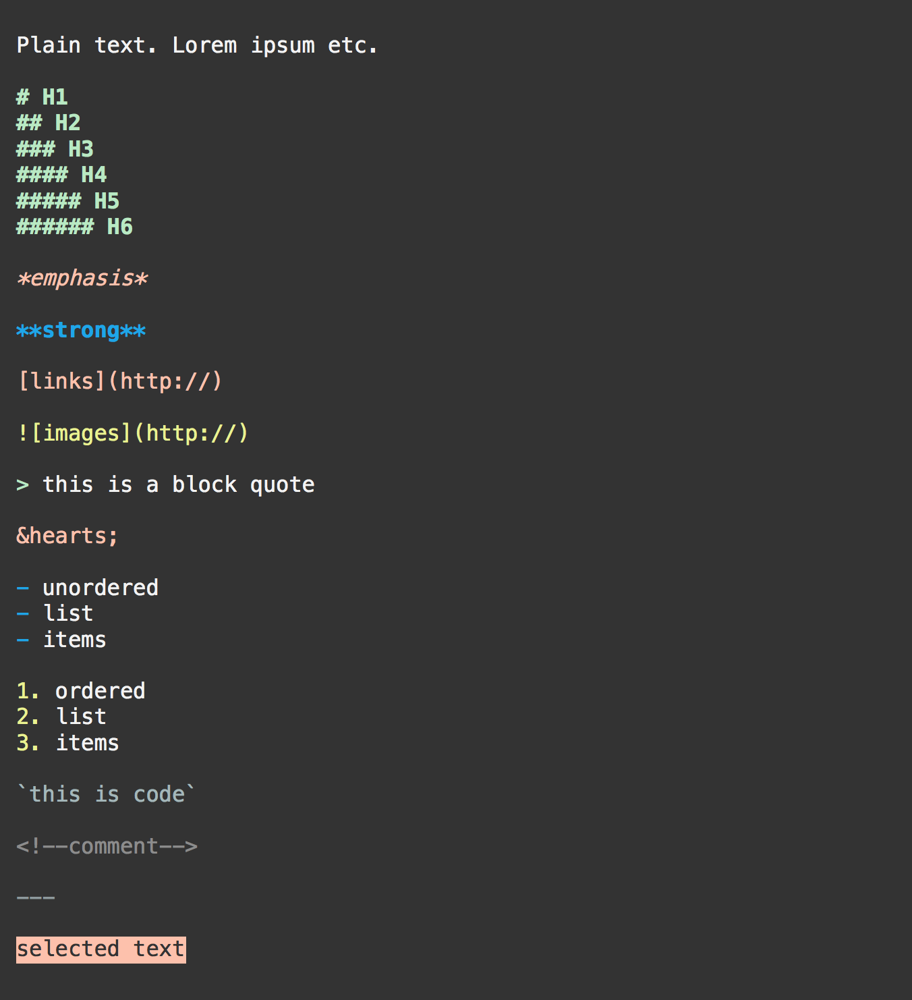
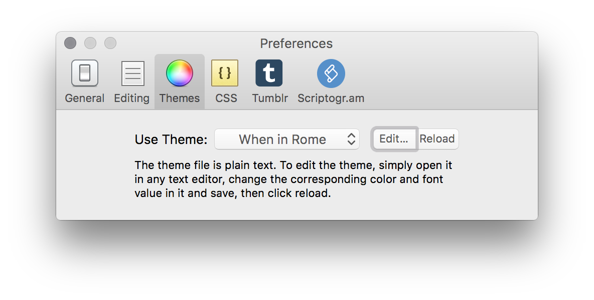

# When in Rome — Custom Theme for Mou Text Editor

## [DOWNLOAD](When in Rome.txt)

**When in Rome** is a custom theme for the [Mou](http://25.io/mou/) Markdown editor. This is *not* a custom style sheet and will not affect live preview or any HTML or PDF exports.

This theme is meant to be one that's easy to read on dim screens, even with [f.lux](https://justgetflux.com/) installed. I've found that most of the pre-installed Mou themes have hard-to-read colors when my brightness is set below 50%, especially for things like code, comments, and horizontal rules, all of which I use often. 

## How to Install

Installation couldn't be easier. Simply place the `When in Rome.txt` file into `~/Library/Application Support/Mou/Themes` 

(*from your terminal, just copy and paste `open ~/Library/Application\ Support/Mou/Themes`*)

Then, open Mou and go to **Mou > Preferences > Themes** (*or &#8984;,*)

Next to **Use Themes**, *When in Rome* should appear as an option. Select it and it should be your new theme.

